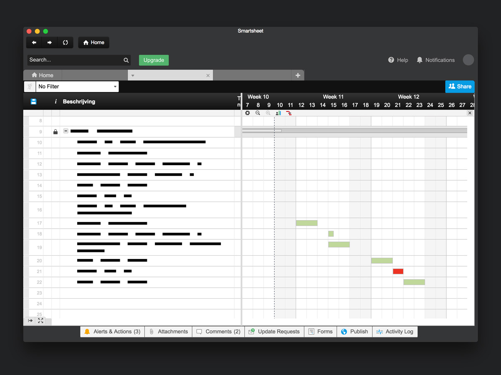

# Smartsheet

_This app is not affiliated to Smartsheet Inc._

This app implemented using Electron is simply a Webview that loads the Smartsheet application.
It inserts a tiny layer of CSS to make the webpage fit the Electron app a little better.

I've built this app because of Chromes horizontal scroll to go back :) Everytime I tried
to scroll inside the Gantt chart I went back in the browser history. This Webview doesn't have this
behaviour. Another plus is that it's available from the OSX dock.



## Development

```
# Install
yarn

# Run
yarn start
```

## Build

```
# OSX
yarn run package-osx

# Windows
yarn run package-win
```

